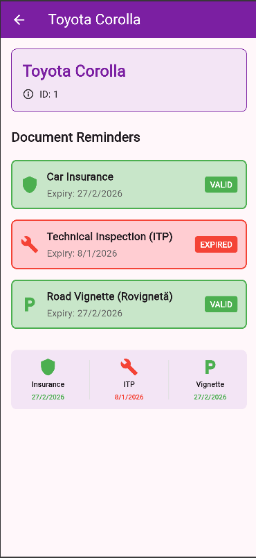
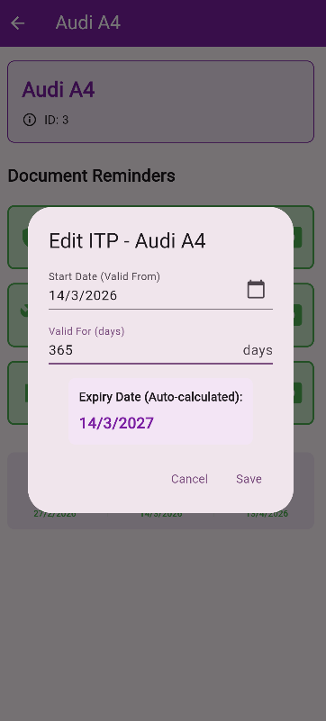

<div align="center">

# 🚗 **Car Reminder App**

</div>

**Car Reminder App** transformă dilema administrativă „Când îmi expiră asigurarea?" într-o experiență organizată și liniștitoare. Dezvoltată în Flutter, aplicația combină un design intuitiv cu funcționalitate robustă pentru a-ți oferi pace sufletească prin monitorizare inteligentă a documentelor vehiculului.

✨ **Experiența Utilizatorului**

Aplicația este construită în jurul a trei piloni fundamentali: Simplitate, Claritate și Eficiență.

🎯 **Dashboard Imediat**: Vizualizare rapidă a tuturor mașinilor și stării documentelor cu sistem semaphor (verde/galben/roșu).
📝 **Gestiune Completă**: Adaugă, editează și șterge mașini cu dialog-uri intuitive și calendar integrat.
🔔 **Alerte Inteligente**: Notificări cu 7 zile înainte de expirare pentru a evita amenzi și probleme legale.
🎨 **Design Modern**: Interfață bazată pe Material Design 3, cu paletă purpurie (Purple[700]) care inspiră încredere și profesionalism.

---

## 🏗️ Arhitectura Proiectului

Codul este organizat modular pentru a respecta bunele practici de dezvoltare:

```
lib/
├── 📱 main.dart              # Punctul de lansare & Tema aplicației
├── 📦 models/
│   └── car.dart              # Model pentru vehicul
├── 💾 services/
│   └── car_service.dart      # Business logic și date inițiale
├── 🎨 constants/
│   ├── app_colors.dart       # Paletă centralizată de culori
│   └── app_strings.dart      # Text-uri UI centralizate
├── 🧮 utils/
│   └── date_utils.dart       # Helper-e pentru calcule de date
├── 🧩 widgets/               # Componente reutilizabile
│   ├── cars_list_view.dart   # Widget listă mașini
│   ├── filter_bar.dart       # Widget filtre documente
│   ├── dialogs/
│   │   ├── edit_document_dialog.dart        # Dialog principal editare
│   │   ├── start_date_picker_field.dart     # Date picker field
│   │   ├── validity_days_field.dart         # Zile validitate input
│   │   ├── expiry_date_preview.dart         # Preview dată expirare
│   │   └── car_updater.dart                 # Logică actualizare car
│   ├── tiles/
│   │   ├── reminder_tile.dart
│   │   └── car_summary_item.dart
│   └── sections/
│       └── expiring_warning_section.dart
└── 🖼️ screens/               # Ecranele principale
    ├── home_screen.dart
    └── car_details_screen.dart
```

---

## 🛠️ Detalii Tehnice de Implementare

| **Caracteristică** | **Tehnologie / Widget Utilizat** |
|-------------------|----------------------------------|
| **State Management** | StatefulWidget cu setState pentru actualizări UI |
| **Navigare** | Navigator.push cu tranziții native |
| **Layout** | Column, Row, ListView pentru structura responsive |
| **Calcule Date** | Logică locală pentru detectare expirare și warning-uri |
| **Color System** | AppColors cu constante centralizate (Purple, Green, Red, Yellow) |
| **Animații** | ScaleTransition pe butoane, transițiile native Flutter |
| **UI Kit** | Material Design 3, Card-uri elevate, Dialog-uri native |

---

## 📋 Documente Monitorizate

Aplicația vine pre-configurată cu **7 vehicule de test** cu stări diferite:

| # | Vehicul | Status | Documente |
|---|---------|--------|-----------|
| 1. | Toyota Corolla | 🔴 Expirat | ITP expirat (-5 zile) |
| 2. | BMW X5 | 🟡 Warning | Asigurare în 7 zile |
| 3. | Audi A4 | 🟢 Valid | Toate în regulă |
| 4. | VW Golf | 🟢 Valid | Toate în regulă |
| 5. | Land Rover Freelander | 🔴 Expirat | Asigurare expirat (-10 zile) |
| 6. | BMW M6 | 🔴 Expirat | Rovigneta expirat (-30 zile) |
| 7. | Nissan Patrol Y61 | 🔴 Expirat | ITP expirat (-15 zile) |

Fiecare vehicul monitorizează:
- **Asigurare RCA/CASCO** - Anuală
- **ITP (Inspecția Tehnică)** - 1-2 ani
- **Rovinietă** - Anuală

---

## 🔍 Sistem de Filtrare

Aplicația include un sistem de filtre inteligent care permite filtrarea rapidă a mașinilor după documente expirate:

- **All**: Afișează toate vehiculele
- **Expired Vignette**: Doar mașini cu rovigneta expirat
- **Expired ITP**: Doar mașini cu ITP expirat
- **Expired Insurance**: Doar mașini cu asigurare expirat

Filtrele se activează printr-un buton **"Filtrează"** care se deschide/închide pe cerere.

---

## 🚀 Instalare și Rulare

### 📋 Pași de Instalare

**1.** Clonează repository-ul

**2.** Verifică integritatea mediului:
```bash
flutter doctor
```

**3.** Instalează dependențele:
```bash
flutter pub get
```

**4.** Lansează în simulator/device:
```bash
flutter run
```

---

## 📱 Platforme Suportate

| | Platformă | Suport |
|---|-----------|--------|
| 📱 | **Mobile** | iOS & Android (Interfață adaptivă) |
| 🌐 | **Web** | Optimizat pentru Chrome/Safari/Edge |
| 💻 | **Desktop** | Windows & macOS (Layout centrat) |

---

## 📸 Capturi de Ecran

| Ecran Principal | Detalii Mașină | Editare Document |
|---|---|---|
|  |  |  |
| Lista mașini cu sistem de filtrare | Documente vehicul | Selectare dată expirare |

---
